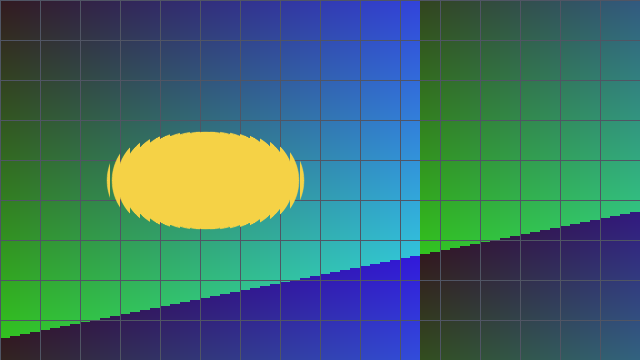

# Slit Scan Camera

Build a time-warp image from camera strips captured at different moments.



## Run independently

Use a standard desktop Python 3.12 installation. On Apple Silicon the pinned
OpenCV wheel requires macOS 13 or later. Do not install several different OpenCV
packages into the same environment.

```bash
python3.12 -m venv .venv
.venv/bin/python -m pip install --only-binary=:all: -r requirements.txt
.venv/bin/python -m unittest discover -s tests -v
.venv/bin/python app.py check
.venv/bin/python app.py camera
```

The enclosing FX kit can instead reuse the existing barcode environment without
installing or changing any packages. See the kit README.

## Controls

R restarts. V sweeps vertically; H sweeps horizontally. Space pauses. Move while the line advances. Q or Esc exits. Close one camera application before opening another.

No recording, network camera input, operating-system controls, or automatic uploads.
To allow an individual processed-image save, start `app.py camera --allow-snapshots`
and press S. Files are saved with unique names under ignored `outputs/`.

## Demonstration and limitations

`app.py demo` writes one synthetic demonstration. `docs/demo.gif` is a synthetic
sequence rendered by the application, not a measured camera performance result.

Time composites are visual effects, not evidence of physical shape or object identity.

Actual image processing and deterministic tests were exercised on Linux. Physical
Mac camera behavior, camera permissions and window interaction remain to be checked
locally. See [validation](docs/VALIDATION.md) and [design](docs/DESIGN.md).

## License

MIT for the application; preserve [third-party notices](THIRD_PARTY.md).
